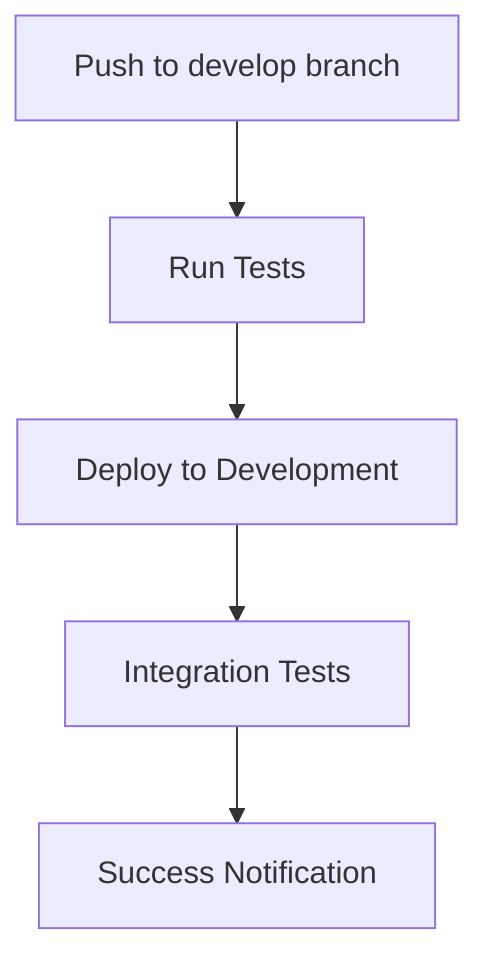
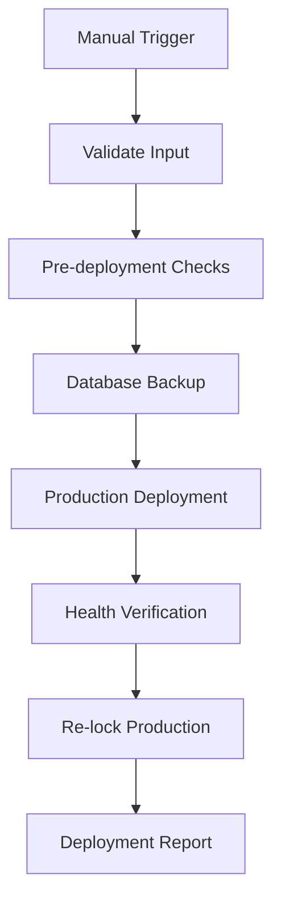

# GitHub Actions Setup Guide

This document provides step-by-step instructions to configure GitHub Actions for automated deployments of the TradingView ML Visualization system.

## 🔐 Required GitHub Repository Secrets

You need to configure the following secrets in your GitHub repository settings:

### Go to: Repository → Settings → Secrets and variables → Actions → New repository secret

### Required Secrets:

1. **`PRODUCTION_SERVER`**
   - **Value**: Your production server IP address
   - **Example**: `5.223.52.98`
   - **Description**: The IP address or hostname of your production server

2. **`SSH_USER`**
   - **Value**: SSH username for server access
   - **Example**: `stocksadmin`
   - **Description**: Username to connect to the production server

3. **`SSH_PRIVATE_KEY`**
   - **Value**: Private SSH key for server access
   - **Description**: RSA private key for passwordless SSH authentication
   - **How to generate**:
     ```bash
     # On your local machine or CI server
     ssh-keygen -t rsa -b 4096 -C "github-actions@yourdomain.com"
     
     # Copy the private key content
     cat ~/.ssh/id_rsa
     
     # Copy the public key to your server
     ssh-copy-id stocksadmin@5.223.52.98
     ```

4. **`DEV_SERVER`** (Optional)
   - **Value**: Development server IP (if different from production)
   - **Example**: `5.223.52.98` (can be same as production)
   - **Description**: IP address of development environment

## 🚀 Available Workflows

### 1. Development Deployment (`deploy-to-development.yml`)
**Trigger**: Push to `develop`, `dev`, or `development` branches, or pull requests to `main`/`master`

**Features**:
- Automated testing (TypeScript, Python, Docker validation)
- Deployment to development environment
- Integration testing
- Safe deployment with rollback capability

**Usage**:
```bash
# Push to development branch
git checkout develop
git push origin develop
```

### 2. Production Deployment (`deploy-to-production.yml`)
**Trigger**: Push to `main`/`master` branch (with safety checks)

**Features**:
- Comprehensive pre-deployment validation
- Automatic backup creation
- Production environment lock/unlock handling
- Health verification with automatic rollback
- Detailed deployment logging

**Usage**:
```bash
# Push to main branch (will trigger production deployment)
git checkout main
git push origin main
```

**Commit Message Controls**:
- Skip deployment: Include `skip deploy`, `no deploy`, `wip`, or `draft` in commit message
- Force deployment: Include `deploy`, `release`, `production`, or `hotfix` in commit message

### 3. Manual Production Deployment (`manual-production-deploy.yml`)
**Trigger**: Manual workflow dispatch only (recommended for production)

**Safety Features**:
- Requires typing "DEPLOY_TO_PRODUCTION" to confirm
- Optional database backup before deployment
- Force unlock option for emergency deployments
- Configurable maintenance window
- Comprehensive verification steps

**Usage**:
1. Go to GitHub → Actions → Manual Production Deploy
2. Click "Run workflow"
3. Fill in the parameters:
   - **Confirmation**: Type exactly `DEPLOY_TO_PRODUCTION`
   - **Backup Database**: ✅ (recommended)
   - **Force Unlock**: ❌ (only for emergencies)
   - **Auto Rollback**: ✅ (recommended)
   - **Maintenance Window**: `15` minutes (or as needed)

## 🛠️ SSH Key Setup

### Step 1: Generate SSH Keys
```bash
# Generate a new SSH key pair for GitHub Actions
ssh-keygen -t rsa -b 4096 -C "github-actions-tradingview" -f ~/.ssh/github_actions_key

# Display the private key (copy this to GITHUB_ACTIONS_SSH_KEY secret)
cat ~/.ssh/github_actions_key

# Display the public key (add this to your server)
cat ~/.ssh/github_actions_key.pub
```

### Step 2: Add Public Key to Server
```bash
# On your production server
echo "ssh-rsa AAAAB3NzaC1yc2E... github-actions-tradingview" >> ~/.ssh/authorized_keys
chmod 600 ~/.ssh/authorized_keys
```

### Step 3: Test SSH Connection
```bash
# Test from your local machine
ssh -i ~/.ssh/github_actions_key stocksadmin@5.223.52.98
```

## 📋 Pre-deployment Checklist

Before setting up GitHub Actions, ensure:

### ✅ Server Requirements
- [ ] SSH access configured for `stocksadmin` user
- [ ] Docker and Docker Compose installed
- [ ] Project repository cloned to `/home/stocksadmin/Quantagro/tradingview-viz`
- [ ] Environment files (`.env.prod`, `.env.dev`) configured
- [ ] Database backup system operational
- [ ] Security scripts installed and tested

### ✅ Repository Setup
- [ ] GitHub repository secrets configured
- [ ] Workflow files committed to repository
- [ ] Branch protection rules configured (optional but recommended)

### ✅ Testing
- [ ] SSH key authentication working
- [ ] Manual deployment scripts tested
- [ ] Database backup tested
- [ ] Application health endpoints responding

## 🔄 Deployment Workflow Process

### Development Deployment


### Production Deployment (Manual)


## 🚨 Emergency Procedures

### Emergency Rollback
If a deployment fails and automatic rollback doesn't work:

1. **Manual Rollback via GitHub Actions**:
   - Go to Actions → Manual Production Deploy
   - Check "Force Unlock" option
   - Deploy previous working commit

2. **Direct Server Rollback**:
   ```bash
   # SSH to server
   ssh stocksadmin@5.223.52.98
   
   # Unlock production
   sudo ./scripts/unlock-production.sh
   
   # Restore from backup
   latest_backup=$(ls -t /opt/tradingview-backups/github_deploy_* | head -1)
   sudo rsync -av --delete "$latest_backup/" /home/stocksadmin/Quantagro/tradingview-viz/
   
   # Restart services
   cd /home/stocksadmin/Quantagro/tradingview-viz
   docker-compose -f docker-compose.unified.yml up -d
   
   # Re-lock production
   sudo ./scripts/lock-production.sh
   ```

### Database Rollback
If database needs to be restored:

```bash
# Check available backups
ls -la /opt/tradingview-db-backups/

# Use restoration script
cd /opt/tradingview-db-backups/current
./restore_YYYYMMDD_HHMMSS.sh
```

## 📊 Monitoring Deployments

### GitHub Actions Logs
- View deployment status: Repository → Actions
- Download logs for troubleshooting
- Check deployment artifacts

### Server Logs
```bash
# Deployment logs
sudo tail -f /var/log/tradingview-deployments.log

# Application logs
docker-compose -f docker-compose.unified.yml logs -f

# Security logs
sudo tail -f /var/log/tradingview-security-alerts.log
```

## 🔧 Customization

### Adding Environment Variables
To add new environment variables to deployments:

1. Add to `.env.prod` and `.env.dev` files
2. Update workflow files if needed
3. Test in development first

### Modifying Health Checks
Update health check URLs in workflow files:
```yaml
# In deploy-to-production.yml
if curl -sf "http://localhost:${BACKEND_PORT:-8888}/your-custom-endpoint"; then
```

### Adding Notification Channels
To add Slack/email notifications:

1. Add webhook URLs to repository secrets
2. Add notification steps to workflow files
3. Use GitHub marketplace actions for integrations

## 🎯 Best Practices

### 1. Branch Strategy
- `develop` → Development deployments
- `main/master` → Production deployments
- Feature branches → No automatic deployment

### 2. Commit Messages
- Use descriptive commit messages
- Include deployment instructions when needed
- Use conventional commits format

### 3. Security
- Regularly rotate SSH keys
- Monitor deployment logs
- Keep secrets up to date
- Use force unlock sparingly

### 4. Testing
- Test all changes in development first
- Run manual deployments during low-traffic hours
- Have rollback plan ready
- Monitor application after deployment

---

**🎉 Your automated deployment pipeline is ready!**

Start with development deployments to verify everything works, then proceed with production deployments using the manual workflow for maximum safety.