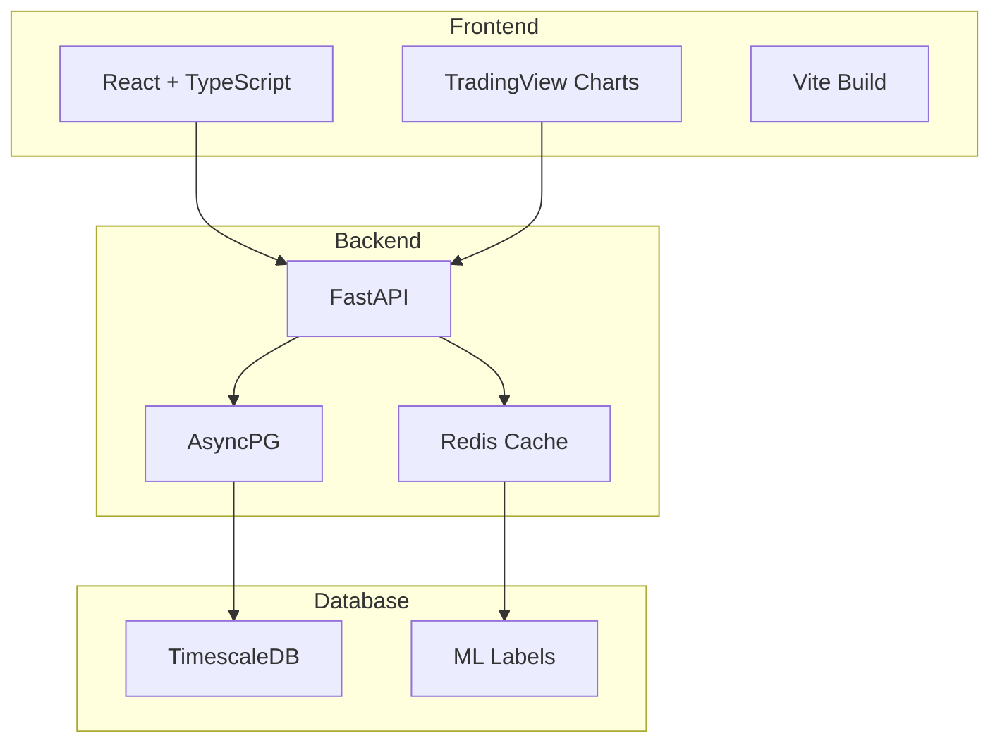

# TradingView ML Visualization System

Enterprise-grade web application for visualizing Nifty50 OHLC data with ML-generated sentiment labels using TradingView's Advanced Chart widget.

## 🏗️ Architecture



## 🚀 Quick Start

### Development Environment

1. **Clone the repository:**
   ```bash
   git clone <repository-url>
   cd tradingview-ml-viz
   ```

2. **Set up environment:**
   ```bash
   cp .env.example .env
   # Edit .env with your configurations
   ```

3. **Start development services:**
   ```bash
   docker-compose -f deployment/docker/docker-compose.dev.yml up -d
   ```

### Production Deployment

1. **Build and deploy:**
   ```bash
   docker-compose -f deployment/docker/docker-compose.prod.yml up -d
   ```

2. **Verify health:**
   ```bash
   curl http://localhost/health
   curl http://localhost/api/health
   ```

## 📦 Project Structure

```
tradingview-ml-viz/
├── backend/                 # FastAPI application
│   ├── app/
│   │   ├── main.py         # Application entry point
│   │   ├── models.py       # Data models
│   │   ├── database.py     # Database connections
│   │   ├── cache.py        # Redis caching
│   │   └── routes/         # API endpoints
│   └── requirements.txt
├── frontend/               # React application
│   ├── src/
│   │   ├── components/     # React components
│   │   ├── services/       # API services
│   │   └── types.ts        # TypeScript types
│   ├── package.json
│   └── vite.config.ts
├── deployment/             # Infrastructure
│   ├── docker/            # Docker configurations
│   ├── kubernetes/        # K8s manifests
│   └── terraform/         # Cloud infrastructure
├── docs/                  # Documentation
└── scripts/               # Operational scripts
```

## 🔧 Configuration

### Environment Variables

See `.env.example` for all available configuration options.

**Required:**
- `DB_HOST`, `DB_USER`, `DB_PASSWORD` - Database connection
- `REDIS_URL`, `REDIS_PASSWORD` - Redis cache
- `SECRET_KEY` - Application secret

**Optional:**
- `ENVIRONMENT` - deployment environment
- `LOG_LEVEL` - logging level
- `CORS_ORIGINS` - allowed origins

### Database Schema

The application uses TimescaleDB with these main tables:
- `nifty50_ohlc` - 1-minute OHLC data
- `ml_labeled_data` - ML sentiment labels
- Continuous aggregates for 5min, 15min, daily data

## 🚨 Health Checks

- **Application**: `GET /health`
- **Database**: `GET /health/db`
- **Cache**: `GET /health/cache`
- **Frontend**: `GET /`

## 📊 Monitoring

- **Metrics**: Prometheus metrics at `/metrics`
- **Logs**: Structured JSON logging
- **Tracing**: OpenTelemetry support

## 🔐 Security

- Non-root Docker containers
- Input validation on all endpoints
- Rate limiting
- CORS configuration
- Security headers

## 🎯 Performance

- **Target Response Time**: <50ms (P50), <200ms (P95)
- **Cache Hit Rate**: >80%
- **Concurrent Users**: 1000+
- **Multi-layer caching**: L1 (memory) + L2 (Redis) + L3 (database)

## 📚 API Documentation

Once running, visit:
- Development: `http://localhost:8000/docs`
- Production: `https://yourdomain.com/api/docs`

## 🔄 Development Workflow

1. **Feature Development**: Work on feature branches
2. **Testing**: Automated tests on pull requests
3. **Staging**: Deploy to staging environment
4. **Production**: Deploy via CI/CD pipeline

## 📖 Documentation

- [API Documentation](docs/api.md)
- [Deployment Guide](docs/deployment.md)
- [Database Schema](docs/database.md)
- [Monitoring Setup](docs/monitoring.md)

## 📄 License

Proprietary - All rights reserved

## 👥 Support

For issues or questions:
- Create an issue in this repository
- Contact the development team
- Check the troubleshooting guide in docs/