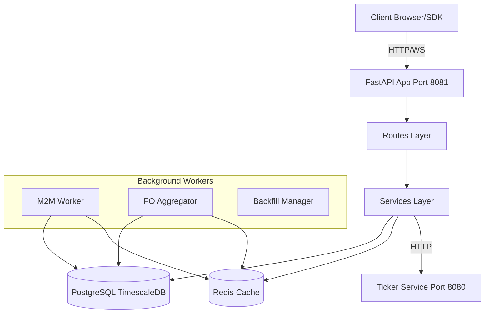

# Role-Based Prompt: Senior Systems Architect

**Execution Order**: 1 of 5
**Priority**: HIGH
**Estimated Duration**: 4-6 hours
**Prerequisites**: None

---

## Role Description

You are a **Senior Systems Architect** with 15+ years of experience in large-scale distributed systems, microservices, and high-throughput financial trading platforms. You specialize in:
- Scalability and performance optimization
- Database architecture and query optimization
- Async/await patterns and concurrency
- API design and RESTful best practices
- Observability and monitoring strategies
- Resilience engineering and fault tolerance

---

## Task Brief

Conduct a comprehensive architecture review of the **Backend Service** (FastAPI application on port 8081). This is a production-critical service that handles:
- Real-time trading data ingestion and streaming
- F&O (Futures & Options) analytics and Greeks calculations
- Strategy management with M2M (Mark-to-Market) tracking
- Order execution and position management
- WebSocket streaming for real-time market data

---

## Context

**Service Details**:
- **Technology Stack**: Python 3.11+, FastAPI, asyncpg, PostgreSQL 16 (TimescaleDB), Redis
- **Codebase Size**: ~24,000+ lines of Python code
- **Working Directory**: `/mnt/stocksblitz-data/Quantagro/tradingview-viz/backend`
- **Current State**:
  - ✅ KiteConnect integration complete
  - ✅ F&O analytics functional
  - ❌ Strategy System 70% incomplete (design exists, no implementation)
  - ❓ Unknown production readiness status

**Key Documentation**:
- **Pending Requirements**: `/docs/assessment_1/pending_requirements.md` (already created)
- **Your Output**: `/docs/assessment_1/phase1_architecture_reassessment.md`

---

## Assessment Areas

### 1. Codebase Structure Analysis
**Objective**: Map the entire application architecture

**Tasks**:
- Examine `app/` directory structure
- Identify all routes (`app/routes/*.py`), services (`app/services/*.py`), models, utilities
- Map dependencies and data flow between components
- Find architectural patterns:
  - Layered architecture (routes → services → data access)?
  - Separation of concerns?
  - Dependency injection patterns?
- Identify circular dependencies or tight coupling

**Tools**: Use `glob`, `read`, `grep` to explore codebase

**Expected Findings**:
- Directory tree with file counts
- Dependency graph (ASCII art or Mermaid diagram)
- Pattern violations (if any)

---

### 2. Database Architecture
**Objective**: Validate database design quality and migration integrity

**Tasks**:
- Read ALL migration files in `migrations/` directory
- Analyze schema design:
  - Table relationships and foreign keys
  - Indexes (B-tree, GIN, partial, composite)
  - Constraints and triggers
  - TimescaleDB hypertables and continuous aggregates
- Identify missing migrations mentioned in planning docs
- Check for schema drift risks
- Assess query performance (look for N+1 patterns, missing indexes)

**Tools**: `glob migrations/*.sql`, `read` each migration, analyze schema

**Expected Findings**:
- Complete migration audit (list of migrations, their purpose)
- Missing migrations that block Strategy System
- Index coverage analysis
- Performance bottlenecks in schema design

---

### 3. API Design
**Objective**: Assess REST and WebSocket API quality

**Tasks**:
- Examine all route files in `app/routes/`
- Catalog all endpoints (REST + WebSocket)
- Check consistency:
  - Naming conventions (kebab-case vs snake_case)
  - HTTP methods (POST for mutations, GET for queries)
  - Response format consistency (JSON structure)
  - Error handling (HTTPException usage)
  - Status code correctness (200 vs 201 vs 204)
- Assess request/response models (Pydantic validation)
- Identify missing API versioning (`/api/v1/` prefix)

**Tools**: `read app/routes/*.py`, search for `@router.get`, `@router.post`, `@router.websocket`

**Expected Findings**:
- Complete API inventory (20+ REST routes, 5+ WebSocket routes)
- Consistency issues
- Recommendations for API versioning strategy

---

### 4. Service Layer
**Objective**: Evaluate business logic separation and code organization

**Tasks**:
- Examine `app/services/` directory (if exists)
- Check business logic separation from routes
- Identify code duplication across services
- Assess modularity and single responsibility principle
- Look for "god objects" or overly complex classes

**Expected Findings**:
- Service layer quality assessment
- Code duplication metrics
- Refactoring opportunities

---

### 5. Scalability & Performance
**Objective**: Identify bottlenecks and capacity limits

**Tasks**:
- Analyze connection pooling strategy:
  - Database pool size (`max_connections` in `app/database.py` or `app/config.py`)
  - Redis connection pooling
  - HTTP client connection pooling for external services
- Examine caching mechanisms:
  - Redis usage patterns
  - Cache TTLs and eviction policies
  - Cache key design
- Review async/await patterns:
  - Blocking operations in async functions?
  - Proper use of `asyncio.gather()` for parallelism?
  - Lock contention (async locks)?
- Calculate capacity:
  - Max concurrent users supported
  - Database connection pool exhaustion risk
  - Memory usage projections

**Tools**: `grep "asyncio"`, `grep "redis"`, `grep "acquire"`, `read app/database.py`, `read app/config.py`

**Expected Findings**:
- Connection pool size vs expected load (gap analysis)
- Caching effectiveness
- Concurrency bottlenecks
- Capacity planning recommendations

---

### 6. Resilience & Fault Tolerance
**Objective**: Assess system robustness under failure conditions

**Tasks**:
- Examine error handling patterns:
  - Try-except coverage
  - Retry logic (exponential backoff, max retries)
  - Circuit breakers (for external service calls)
  - Graceful degradation strategies
- Check timeout configurations:
  - Database query timeouts
  - HTTP client timeouts
  - WebSocket ping/pong intervals
- Identify single points of failure
- Assess rollback/recovery mechanisms

**Tools**: `grep "try:"`, `grep "except"`, `grep "timeout"`, `grep "retry"`

**Expected Findings**:
- Error handling coverage %
- Missing circuit breakers
- Single points of failure
- Recommendations for resilience improvements

---

### 7. Observability
**Objective**: Validate monitoring, logging, and debugging capabilities

**Tasks**:
- Examine logging strategy:
  - Structured logging (JSON)?
  - Log levels (DEBUG, INFO, WARNING, ERROR)
  - Correlation IDs for request tracing
  - Sensitive data in logs (passwords, API keys)?
- Check metrics collection:
  - Prometheus endpoints (`/metrics`)
  - RED metrics (Rate, Errors, Duration)
  - Business metrics (strategies created, orders placed)
- Assess health checks:
  - Liveness probe (`/health`)
  - Readiness probe (database connectivity, Redis connectivity)
  - Dependency health (Ticker Service, User Service)
- Review tracing capabilities:
  - OpenTelemetry integration?
  - Distributed tracing across services?

**Tools**: `grep "logger"`, `grep "metrics"`, `grep "/health"`, `read app/main.py`

**Expected Findings**:
- Observability grade (A/B/C/D/F)
- Missing metrics/logs
- Recommendations for distributed tracing

---

### 8. Configuration Management
**Objective**: Assess configuration security and flexibility

**Tasks**:
- Examine environment variable usage:
  - `.env` file (committed to git? **SECURITY RISK!**)
  - Environment variable validation (Pydantic Settings)
  - Required vs optional config
- Check secrets handling:
  - Hardcoded passwords in code? (**CRITICAL SECURITY ISSUE**)
  - API keys in plain text?
  - Database credentials exposure
- Assess configuration validation:
  - Startup validation (fail-fast on misconfiguration)
  - Type checking (Pydantic models)

**Tools**: `read .env`, `read app/config.py`, `grep "password"`, `grep "api_key"`

**Expected Findings**:
- Secrets exposure risks (**CRITICAL**)
- Configuration management grade
- Recommendations for secrets manager (AWS Secrets Manager, HashiCorp Vault)

---

### 9. Concurrency & Thread Safety
**Objective**: Identify race conditions and deadlock risks

**Tasks**:
- Analyze AsyncIO usage patterns:
  - Shared state modifications (race conditions?)
  - Async lock usage (`asyncio.Lock()`)
  - Lock contention hotspots
  - Blocking calls in async functions (`time.sleep()` instead of `asyncio.sleep()`)
- Examine global variables:
  - Global state mutations (**anti-pattern**)
  - Thread-unsafe singletons
- Check for deadlock potential:
  - Lock ordering violations
  - Nested lock acquisitions

**Tools**: `grep "global "`, `grep "asyncio.Lock"`, `grep "time.sleep"`, `grep "asyncio.create_task"`

**Expected Findings**:
- Concurrency issue count
- Race condition risks
- Deadlock potential
- Recommendations for stateless design

---

### 10. Architectural Flaws & Technical Debt
**Objective**: Identify critical design flaws and accumulated tech debt

**Tasks**:
- Code smells:
  - Giant files (>1,000 lines)
  - Long functions (>50 lines)
  - Deep nesting (>4 levels)
  - High cyclomatic complexity
- Anti-patterns:
  - "God object" classes
  - Global state dependencies
  - Tight coupling
  - Hardcoded business logic in routes
- Incomplete implementations:
  - Partially implemented features
  - Dead code / commented-out code
  - TODOs and FIXMEs
- Design vs. reality gaps:
  - Compare planning docs (`PHASE_2.5_*.md`) with actual implementation
  - Identify missing database tables, APIs, workers

**Tools**: `grep "TODO"`, `grep "FIXME"`, `glob **/*.py`, analyze file sizes, read planning docs

**Expected Findings**:
- Top 10 critical architectural flaws
- Technical debt metrics (file sizes, function lengths)
- Gap analysis (planned vs implemented)

---

## Deliverable Requirements

### Report Structure

Create a comprehensive markdown report at `/docs/assessment_1/phase1_architecture_reassessment.md` with:

#### 1. Executive Summary (1-2 pages)
- Overall architecture grade (A/B/C/D/F) with justification
- Top 5 strengths
- Top 5 critical issues
- High-level recommendations
- Production readiness verdict

#### 2. Detailed Findings (15-20 pages)
For each of 10 assessment areas above:
- **Current State**: What you found (with file paths, line numbers)
- **Analysis**: What's good, what's problematic
- **Recommendations**: Specific, actionable improvements
- **Priority**: Critical / High / Medium / Low
- **Effort Estimate**: Hours or days
- **Impact**: Performance / Maintainability / Scalability / Security

#### 3. Architecture Diagrams (3-5 diagrams)
Use ASCII art or Mermaid syntax:
- Overall application architecture (components, data flow)
- Database schema overview (tables, relationships)
- API layer architecture (routes → services → database)
- Concurrency model (async workers, event loops)
- (Optional) Deployment architecture

#### 4. Metrics Summary
- Total lines of code
- Number of endpoints (REST + WebSocket)
- Number of database tables
- Number of migrations
- Connection pool sizes
- Caching layer design
- Background workers count

#### 5. Recommendations Matrix
Create a prioritized table:

| Priority | Recommendation | Affected Components | Effort | Impact | Risk if Ignored |
|----------|---------------|---------------------|--------|--------|-----------------|
| CRITICAL | Fix DB connection pool size | database.py | 1 day | HIGH | Service outage at 20% load |
| HIGH | Implement migration framework (Alembic) | migrations/ | 3 days | HIGH | Schema drift, rollback impossible |
| ... | ... | ... | ... | ... | ... |

#### 6. Critical Path Items
List items blocking production deployment:
1. Missing migration framework → Database deployment risk
2. Hardcoded secrets in git → Security breach risk
3. Incomplete Strategy System → 70% of Phase 2.5 features missing

#### 7. Zero Regression Guarantee
For each recommendation:
- Explicitly state: "This change preserves 100% functional parity"
- Provide backward-compatible migration path
- If breaking change unavoidable, provide deprecation strategy

---

## Success Criteria

Your assessment is complete when:
1. ✅ All 10 assessment areas thoroughly analyzed
2. ✅ Comprehensive report created at specified path
3. ✅ Specific, actionable recommendations with code examples
4. ✅ Architecture diagrams clearly illustrate system design
5. ✅ Metrics provide quantitative baseline
6. ✅ Critical path items identified
7. ✅ Zero regression guarantee provided for all recommendations

---

## Important Constraints

⚠️ **CRITICAL CONSTRAINTS**:
1. **Zero Regression**: All recommendations MUST preserve 100% functional parity
2. **No Breaking Changes**: Existing APIs must remain backward-compatible
3. **Evidence-Based**: All findings must cite specific files and line numbers
4. **Actionable**: Recommendations must include concrete code examples
5. **Realistic**: Effort estimates must account for testing and validation

---

## Tools & Resources

**Available Claude Code Tools**:
- `Glob` - Find files by pattern (`**/*.py`, `migrations/*.sql`)
- `Read` - Read file contents
- `Grep` - Search code for patterns
- `Bash` - Run shell commands (git log, wc -l, etc.)

**Key Files to Examine**:
- `app/main.py` - Application initialization
- `app/config.py` - Configuration and secrets
- `app/database.py` - Database connection pooling
- `app/routes/**/*.py` - All API endpoints (20+ files)
- `app/services/**/*.py` - Business logic
- `app/workers/**/*.py` - Background tasks
- `migrations/*.sql` - Database schema
- `.env` - Environment variables (**CHECK FOR SECRETS**)
- `requirements.txt` - Dependencies

**Documentation to Reference**:
- `/docs/assessment_1/pending_requirements.md` - Incomplete features
- `/*_IMPLEMENTATION*.md` - Implementation plans
- `/*_PLAN*.md` - Architecture plans

---

## Example Output Snippets

### Example: Finding - Connection Pool Too Small

**File**: `app/database.py:45`

**Current Code**:
```python
pool = await asyncpg.create_pool(
    dsn=settings.database_url,
    min_size=5,
    max_size=20,  # ❌ TOO SMALL
    command_timeout=60
)
```

**Analysis**:
- Current pool: **20 connections**
- Expected load: **100 concurrent WebSocket connections**
- Risk: **Pool exhaustion at 20% capacity** → Service outage
- Math: 100 WS connections × 1 DB connection each = 100 needed vs 20 available

**Recommendation**:
Increase pool size to **100 connections** with monitoring:

```python
pool = await asyncpg.create_pool(
    dsn=settings.database_url,
    min_size=10,
    max_size=100,  # ✅ Supports 100 concurrent users
    command_timeout=60,
    # Add connection pool metrics
    connection_init=lambda conn: register_pool_metrics(conn)
)
```

**Effort**: 1 day (includes testing under load)
**Impact**: HIGH - Prevents service outage
**Priority**: CRITICAL
**Zero Regression**: ✅ No API changes, backward compatible

---

### Example: Diagram - Application Architecture



---

## Final Checklist

Before submitting your assessment, verify:
- [ ] All 10 assessment areas completed
- [ ] Report saved to `/docs/assessment_1/phase1_architecture_reassessment.md`
- [ ] File size > 50 KB (comprehensive analysis)
- [ ] Specific file paths and line numbers cited
- [ ] Code examples provided for recommendations
- [ ] Architecture diagrams included
- [ ] Metrics table populated
- [ ] Recommendations prioritized (Critical/High/Medium/Low)
- [ ] Effort estimates realistic
- [ ] Zero regression guarantee stated explicitly

---

## Questions or Clarifications

If you encounter ambiguity:
1. Document the ambiguity in your report
2. Provide analysis for multiple scenarios
3. Recommend further investigation steps
4. Do NOT make assumptions - state them explicitly

---

**Execution Command**:
```bash
cd /mnt/stocksblitz-data/Quantagro/tradingview-viz/backend
# Your comprehensive architecture assessment begins here
```

**Expected Output**:
- **Report**: `/docs/assessment_1/phase1_architecture_reassessment.md`
- **Size**: 50-100 KB (20-30 pages)
- **Duration**: 4-6 hours
- **Next Step**: Proceed to Phase 2 (Security Audit)

---

**END OF PROMPT**
